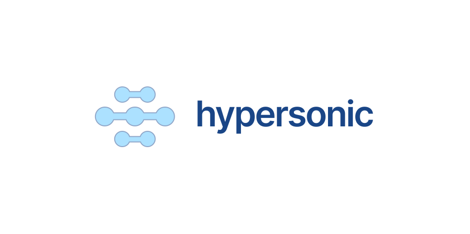

# Hypersonic

A multi-player markdown editor and wiki. Works offline too!

## Features

- Markdown editor using VSCode's Monaco.
- Multi-user, multi-device.
- Backed by CRDTs via [Yjs](https://yjs.dev) and [Liveblocks](https://liveblocks.io/document/yjs).
- Ultra-slim UI. Minimal menus & toolbars.
- Read & Write mode <kbd>CTRL</kbd> + <kbd>M</kbd>
- Vim mode.
- Offline mode.
- Fuzzy-finder <kbd>CTRL</kbd> + <kbd>K</kbd>
- Installable as a PWA.
- Authentication with [Auth.js](https://authjs.dev).

## Shortcuts

| Action                 | Shortcut                                          |
| ---------------------- | ------------------------------------------------- |
| Search files           | <kbd>CTRL</kbd> + <kbd>K</kbd>                    |
| New file               | <kbd>CTRL</kbd> + <kbd>SHIFT</kbd> + <kbd>N</kbd> |
| Toggle Read/Write Mode | <kbd>CTRL</kbd> + <kbd>M</kbd>                    |
| Toggle Vim             | <kbd>CTRL</kbd> + <kbd>SHIFT</kbd>+ <kbd>V</kbd>  |

## License

BSL - Business Software License. Free for personal use.
